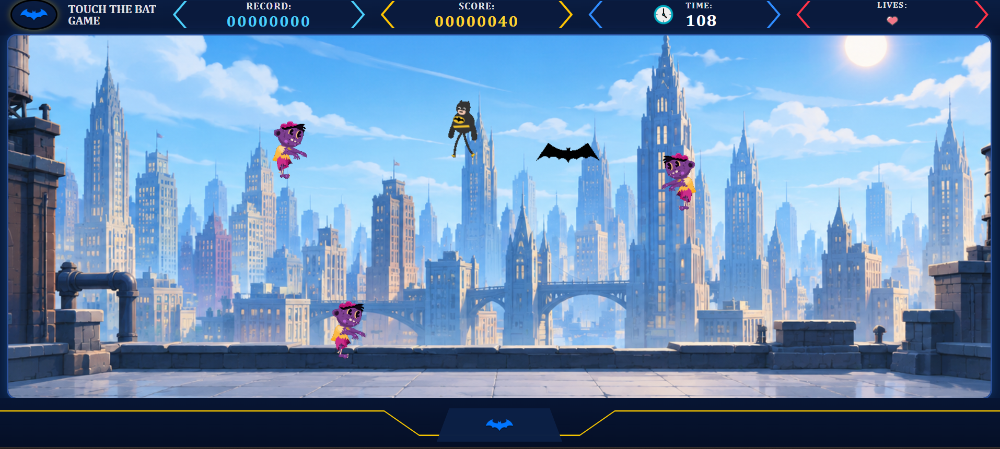

# 🦇 Catch The Bat

A Batman-themed browser game built with HTML, CSS, and JavaScript.

Control Batman, catch bats to earn points, and survive against zombies that become faster and more aggressive as the game progresses. The game features collision detection, random spawning mechanics, and simple AI-driven enemies with different movement behaviors.

##  Play Online

👉[Play Here](https://mahdi-nouri296.github.io/catch-the-bat/)

##  Preview

## Features

- Keyboard-based player controls
- Score tracking system
- High score (record) system
- Timer system
- Multiple lives
- Random spawning mechanics
- Progressive difficulty scaling
- Zombie AI with two different movement behaviors:
  - Random wandering movement
  - Player-chasing movement

## Controls

- ↑ Move Up
- ↓ Move Down
- ← Move Left
- → Move Right

## Technologies Used

- HTML5
- CSS3
- JavaScript
- DOM Manipulation
- Event Handling

## Future Improvements

- Mobile controls
- Responsive design
- Pause menu

## Author
Mahdi Nouri

Github: https://github.com/mahdi-nouri296
